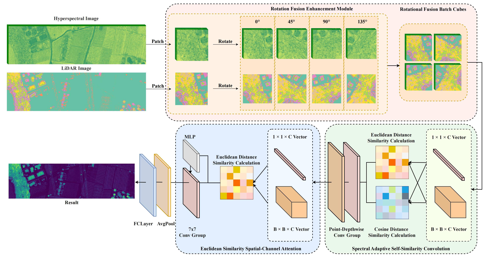

# [RoSENet: Rotation and Similarity Enhancement Network for Multimodal Remote Sensing Image Land Cover Classification](https://ieeexplore.ieee.org/abstract/document/10967546)

Bokun Ma; Caihong Mu; Yi Liu; Xinyu He; Mosa Haidarh

---------------------

B. Ma, C. Mu, Y. Liu, X. He and M. Haidarh, "RoSENet: Rotation and Similarity Enhancement Network for Multimodal Remote Sensing Image Land Cover Classification," in IEEE Transactions on Geoscience and Remote Sensing, vol. 63, pp. 1-18, 2025, Art no. 5511318, [doi: 10.1109/TGRS.2025.3561850.]

---------------------

## Model

Flowchart of the proposed Rotation and Similarity Enhanced Network (RoSENet) for HSI and LiDAR data fusion.

## Abstract
Multimodal classification methods have been widely applied in remote sensing (RS) land cover (LC) classification tasks. However, the existing multimodal classification methods often face challenges such as insufficient information extraction, sensitivity to noise, and inadequate utilization of complex spectral-spatial features during data fusion. To address these issues, this article proposes a rotation and similarity enhancement network (RoSENet) for multimodal RS LC classification by using hyperspectral image (HSI) data together with light detection and ranging (LiDAR) data. RoSENet consists of three key modules. First, the rotation fusion enhancement (RFE) module significantly increases the diversity of input HSI and LiDAR data and improves the model’s generalization ability through multiangle rotation and spectral direction concatenation. Second, the spectral adaptive self-similarity convolution (SASSC) module ensures comprehensive preservation and fusion of spectral and spatial features through adaptive similarity measurement and convolution operations, enhancing the recognition of different classes in complex scenes. Third, the Euclidean similarity spatial-channel attention (ESSCA) module effectively strengthens global feature representation by capturing the resemblance between the central spectral vector and those situated in the surrounding area, improving the model’s robustness in noisy environments. Extensive experiments are carried out on three public datasets, and the experimental results reveal that RoSENet demonstrates significant advantages in terms of overall accuracy (OA), average accuracy (AA), and the Kappa coefficient. Compared to traditional single-modal models, including convolutional neural networks (CNNs), and state-of-the-art single-modal and multimodal transformer models, RoSENet better captures detailed features in classification tasks and effectively reduces the impact of noise on classification accuracy.

---------------------

## Main environment
```
Python == 3.10
PyTorch == 2.1.1
```

## Running

```bash
python ./Model/RoSENet_main.py
```
---------------------
## Non-overlapping Sample Dataset

Get the dataset (Houston11x11\Trento11x11\MUUFL11x11 folder) from (https://pan.baidu.com/s/12SLpvIHJzTmckxIKhFGFKA)

Password:tgrs

## Dataset

* **Houston** was acquired by the ITRES CASI-1500 sensor over the University of Houston campus, TX, USA, in June 2012. This data set was originally released by the 2013 IEEE GRSS data fusion contest2, and it has been widely applied for evaluating the performance of land cover classification. The original image is 349 × 1905 pixels recorded in 144 bands ranging from 0.364 to 1.046 μm.

* **Trento** AISA Eagle sensors were used to collect HSI data over rural regions in the south of Trento, Italy, where the Optech ALTM 3100EA sensors collected LiDAR data. There are 63 bands in each HSI with wavelength ranging from 0.42-0.99 μm, and 1 raster in the LiDAR data that provides elevation information. The spectral resolution is 9.2 nm, and the spatial resolution is 1 meters per pixel. The scene comprises 6 vegetation land-cover classes that are mutually exclusive and a pixel count of 600 × 166.

* **Muufl** The MUUFL Gulfport scene was collected over the campus of the University of Southern Mississippi in November 2010 using the Reflective Optics System Imaging Spectrometer (ROSIS) sensor. There are 325 × 220 pixels with 72 spectral bands in the HSI of this dataset. The LiDAR image of this dataset contains elevation data of 2 rasters. The 8 initial and final bands were removed due to noise, giving a total of 64 bands. The data depicts 11 urban land-cover classes containing 53687 ground truth pixels.
---------------------
## Citation

If this code is useful and helpful for your research, please cite the original work as follows:

```bibtex
@ARTICLE{10967546,
  author={Ma, Bokun and Mu, Caihong and Liu, Yi and He, Xinyu and Haidarh, Mosa},
  journal={IEEE Transactions on Geoscience and Remote Sensing}, 
  title={RoSENet: Rotation and Similarity Enhancement Network for Multimodal Remote Sensing Image Land Cover Classification}, 
  year={2025},
  volume={63},
  number={},
  pages={1-18},
  keywords={Laser radar;Feature extraction;Accuracy;Transformers;Training;Noise;Data mining;Convolutional neural networks;Convolution;Deep learning;Convolutional neural networks (CNNs);hyperspectral image (HSI) classification;multimodal fusion;self-similarity},
  doi={10.1109/TGRS.2025.3561850}
}


